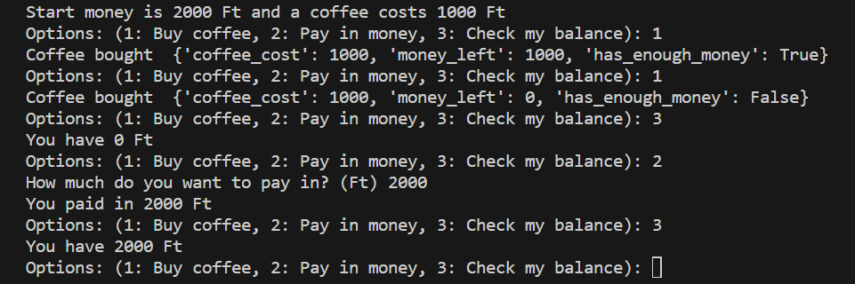
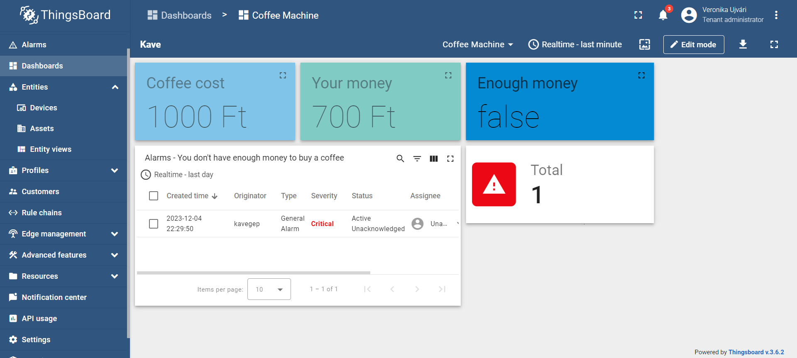
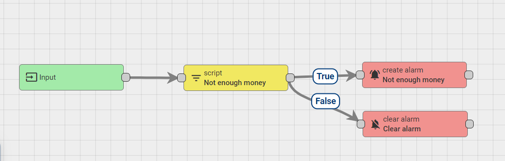
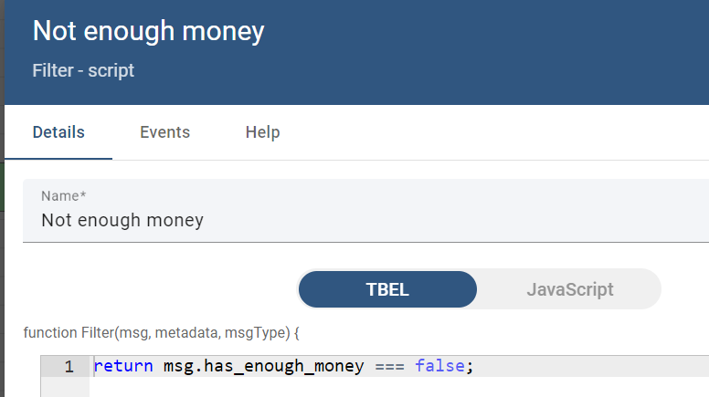
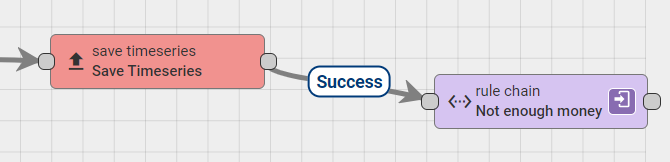

# Coffee Machine in Thingsboard

The python code sends data to Thingsboard, like how much money you have, whether it is enough to buy a coffee or not, and the current cost of the coffee.

If you start the python script, you can do the following:

- Buy a coffee (only if you have enough money)
- Pay in money (to buy more coffee in the future)
- Check your balance, how much money you have left

## Created Dashboard in Thingsboard

On the created dashboard, you can see your current money what's left, whether it is enough to buy a coffee  or not, and the current cost of the coffee. Also, you can see alerts, which indicating that you don't have enough money.

## How to run

- Install Thingsboard [On Premise](https://thingsboard.io/docs/user-guide/install/windows/) or [using Docker](https://thingsboard.io/docs/user-guide/install/docker-windows/).
- Create a device in your Thingsboard.
- In the python code, change the THINGSBOARD_HOST and the DEVICE_ACCESS_TOKEN constants.
- Create the alarm and the dashboard in thingsboard (or you can import the .json files).
- Install the python dependencies then run the python code in your terminal:

`pip install mqtt`

`python coffee_machine.py`

### Create the alarm

1. Create a new rule chain

It will send an alarm if you have not enough money to buy a coffee. You can import it with the help of the not_enough_money_alarm.json file.

The script:

2. Change the root rule chain

Attach the new, alarm rule chain at the end of the root rule chain.

